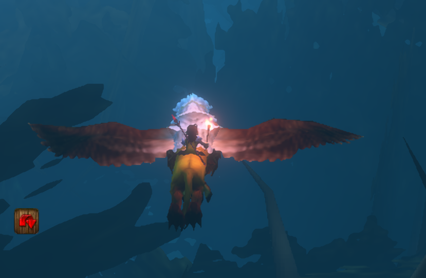

# Night Watch Torch

Relight your Night Watchman's Torch with one click after combat in WoW Forever beta.

**Night Watch Torch** shows a **Light Torch** button below the center of your screen when you need it. Click the button to light your torch.

The button appears when:

- You are outside combat and alive.
- You are in Duskwood, or another zone you selected.
- Night Watchman's Torch is in your bags.
- The torch buff is missing and the item cooldown is ready.
- You are not casting or channeling.

The button hides during combat. When combat ends, an enabled helper clears X dismissal and the Hide timer, then returns after your combat delay when the torch buff is missing and the item is ready. Explicitly turning the helper off still keeps it off. A real click is required to use the item.

A smaller **Hide** button can hide both buttons for a while. It is **off by default**; enable **Show Hide button** in settings. The hide duration defaults to **5 minutes**, and the timer survives a UI reload. Turning the option off clears any active hide timer.

## Settings and moving buttons

Enable **Fade buttons when not hovered** to fade the buttons out after a chosen number of seconds. The default time is **10 seconds**, and fading is **off by default**. Hover over either button's position to reveal both again. They fade over half a second and stay fully visible while hovered or in settings previews. Each new reminder starts with a fresh fade timer.

Find **Night Watch Torch** under **Options → AddOns**, then click **Open settings and move buttons**. You can also type `/nwt`.

Click the small **X** at the top-right of **Light Torch** to hide the helper for this zone visit. Leaving and re-entering the selected zone clears both this dismissal and the optional Hide timer. Moving between subzones does not reset them, and reloading in the same zone keeps the helper hidden. Use `/nwt show` to restore it sooner. Disabling **Show torch helper** or using `/nwt off` keeps it disabled across zone changes.

Lighting your torch again turns the helper back on and clears X dismissal and the Hide timer, including after `/nwt off`. A torch already lit when you log in or reload also restores the helper. The reminder stays hidden while the torch buff is active and resumes its normal checks when it wears off.

Type `/nwt` to open settings. Set the hide duration in minutes and the delay after combat in seconds, then click **Save**. The delay defaults to **10 seconds**. The update changes the old zero default to 10 once; you can still choose zero afterward.

The reminder also waits while eating or drinking. It appears only after your meal ends and the post-combat delay has elapsed. Ordinary casts and meals do not restart the fade timer. Food, Drink, Food & Drink, and Refreshment buffs are recognized; the long-lived Well Fed bonus does not block the reminder.

While settings are open, the torch button and the Hide button (if enabled) appear as previews even if you are outside the selected zone or do not have the torch. Drag either visible button to move it; their positions save separately. Preview buttons do not use the torch or start a hide timer. Combat temporarily hides the previews and prevents moving them.

**Show again now** clears the hide timer. **Reset positions** puts both buttons back below the center of the screen. Close settings to resume normal behavior.

## In game

User-supplied screenshot showing the Light Torch button in game. Other interface elements belong to the game or other installed addons.

User-supplied gameplay screenshot of the lit torch during a gryphon flight.

## Commands

- `/nwt` or `/nwt settings` - open settings and movable previews.
- `/nwt show` - clear the hide timer.
- `/nwt help` - show command help.
- `/nwt zone` - use your current zone instead of Duskwood.
- `/nwt on` or `/nwt off` - turn the helper on or off.
- `/nwt reset` - turn it on and restore Duskwood.

## Install

Download the ZIP from Releases and copy its `NightWatchTorch` folder into `_classic_beta_/Interface/AddOns`. Enable **Night Watch Torch** in the AddOns list and reload the UI. Restart the game if the new addon is not detected.

## Beta support

Built for WoW Forever beta 1.60.1 (interface 16001). The initial version has been reported working in game by its user. Lua loading and simulated checks passed for bags, buffs, cooldowns, zone selection, and combat guards. This is an early beta; not every situation has been tested in game.

Found a problem? Open a GitHub issue with your game version, zone, what happened, and any Lua error.

## License

Addon code: MIT, copyright 2026 Videocat. The supplied gameplay image shows World of Warcraft, which belongs to Blizzard Entertainment; it is not covered by the code license. This is an unofficial addon.
