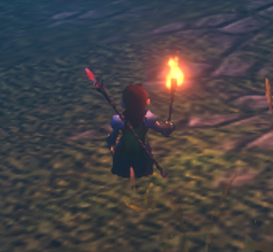
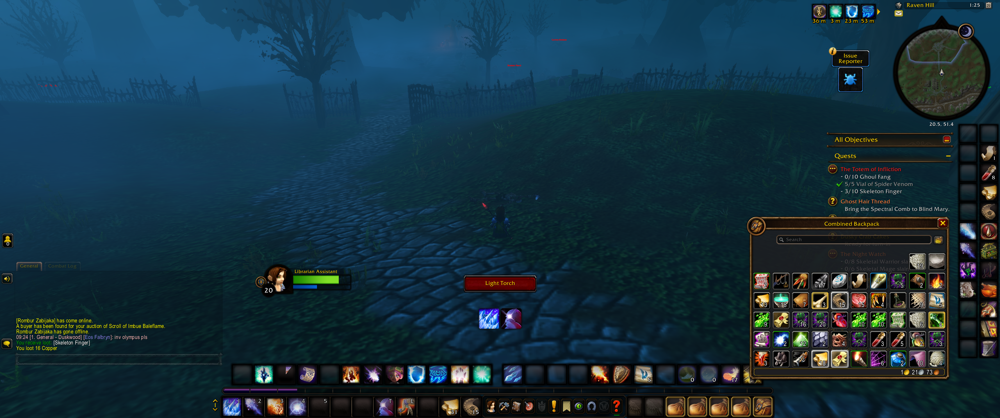

# Night Watch Torch

Relight your Night Watchman's Torch with one click after combat in WoW Forever beta.

**Night Watch Torch** shows a **Light Torch** button below the center of your screen when you need it. Click the button to light your torch.

The button appears when:

- You are outside combat and alive.
- You are in Duskwood, or another zone you selected.
- Night Watchman's Torch is in your bags.
- The torch buff is missing and the item cooldown is ready.
- You are not casting or channeling.

The button hides during combat. After combat, it returns when the torch is ready. A real click is required to use the item.

## In game

User-supplied screenshot showing the Light Torch button in game. Other interface elements belong to the game or other installed addons.

## Commands

- `/nwt` - show your settings and help.
- `/nwt zone` - use your current zone instead of Duskwood.
- `/nwt on` or `/nwt off` - turn the helper on or off.
- `/nwt reset` - turn it on and restore Duskwood.

## Install

Download the ZIP from Releases and copy its `NightWatchTorch` folder into `_classic_beta_/Interface/AddOns`. Enable **Night Watch Torch** in the AddOns list and reload the UI. Restart the game if the new addon is not detected.

## Beta support

Built for WoW Forever beta 1.60.1 (interface 16001). The initial version has been reported working in game by its user. Lua loading and simulated checks passed for bags, buffs, cooldowns, zone selection, and combat guards. This is an early beta; not every situation has been tested in game.

Found a problem? Open a GitHub issue with your game version, zone, what happened, and any Lua error.

## License

Addon code: MIT, copyright 2026 Videocat. The supplied gameplay image shows World of Warcraft, which belongs to Blizzard Entertainment; it is not covered by the code license. This is an unofficial addon.
